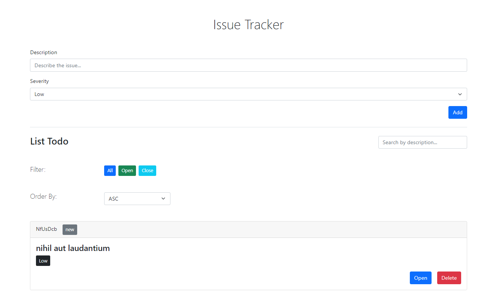

## Project React Issue Tracker

An application used to manage issue tracker, built with React, JavaScript, and Bootstrap.

In React use useContext hook, useReducer hook.

## Project Screen Shot(s)

## Installation and Setup Instructions

Clone down this repository. You will need `node` and `npm` installed globally on your machine.

Installation:

`npm install`

To Run Test Suite:

`npm test`

To Start Server:

`npm start`

To Visit App:

`localhost:3000`
